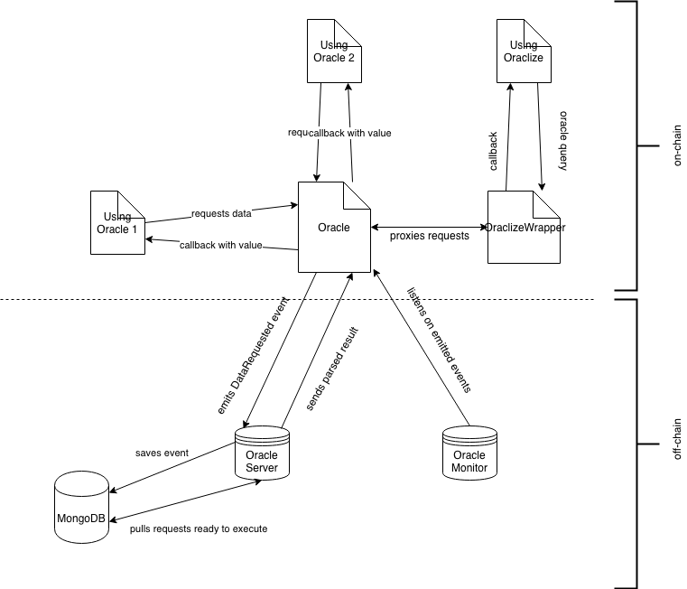

---------------
Introduction
---------------

What is Gardener?
-----------------
Oracle is a concept of getting information from outside of the blockchain to the smart contracts. Out of the box smart contracts cannot access anything outside of the blockchain network. That's where the oracle idea fits. The information exchange begins with the smart contract emitting an event describing the necessary information. A trusted off-chain server listening for such events parses it, gets data from a data source and passes it back to the smart contract.

Why do we need Gardener?
------------------------

Blockchains function in a closed, trustless environment and can’t get any information from outside the blockchain due to security reasons or so-called sandboxing. You can treat everything within the node network as a single source of truth, secured by the consensus protocol. Following the consensus, all nodes in the network agree to accept only one version of their managed state of the world. Think of it like blinders on a horse — useful, but not much perspective.

However, sometimes the information available in the network isn’t enough. Let’s say I need to know what the price of gold is on a blockchain-based derivatives trading app. Using only data from inside the blockchain we have no way of knowing that. Because the smart contract lives in the sandboxed environment it has no option to retrieve that data by itself, the only viable alternative is to request that data and wait for some external party we trust to send it back. That’s where the utility of blockchain oracles come in.

How does Gardener work?
------------------------
This section is going to describe request workflow from asking contract with specific request up to returning result into it. During reading it would be helpful to take a look at the architecture diagram in a `Gardener architecture`_ section.

According to the diagram, let's start from UsingOracle 1 contract. It interacts with Oracle contract with passing request parameter to fetch the data it needs to its calculation/decision. Oracle contract emits then DataRequested (or DelayedDataRequested) event. Gardener server is listening to both of these event types and stores every incoming event into the persistence layer (in memory or MongoDB currently). When requests are ready to execute, they are pulled by the server, fetched from external data sources, parsed accordingly and result data in a form of value and error code (0 when the request is fulfilled successfully) is passed to Oracle contract using account passed in the server configuration. In the current model all costs related to transaction fees are covered by this account (in the future we plan to introduce more pricing models). Oracle contract then proxies this data to asking contract fulfilling the whole workflow.

Gardener architecture
---------------------

